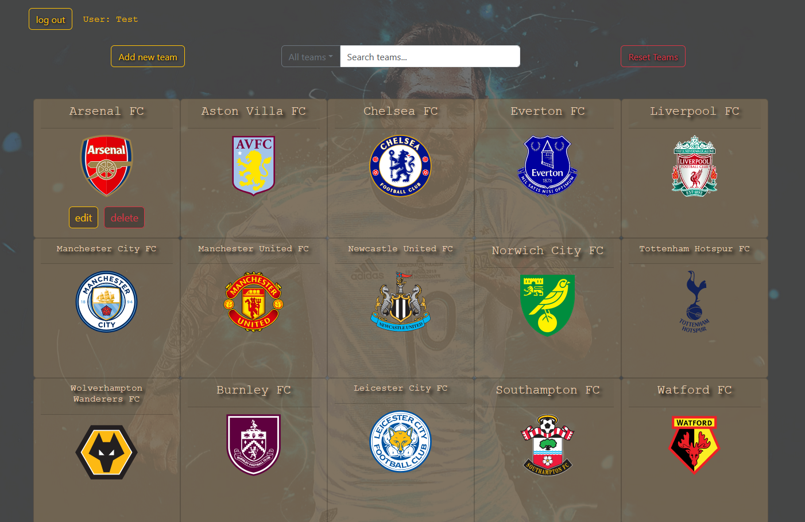
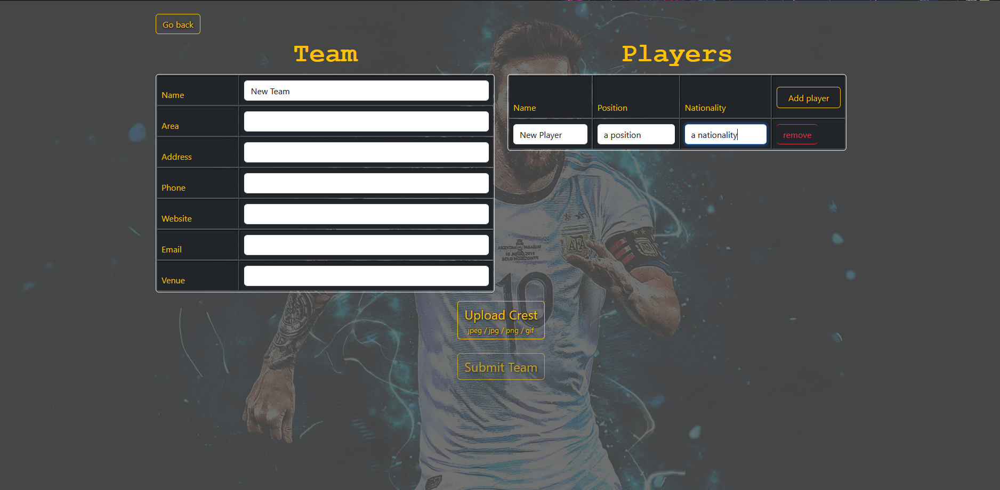
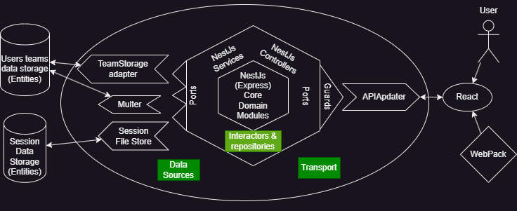

# Football teams CRUD project

## About the Project

This project serves as a playground for exploring full-stack web development concepts. It began
with a basic Express/Handlebars structure and evolved to incorporate React, NestJS, NextJS, and
TypeScript for a comprehensive frontend and backend experience as well as Cypress and Jest
for robust testing. It also includes SQlite and TypeORM for database management and storing data

## Expanded Description of Key Features: 

### Team Management

    Create: Add new teams with customized names, properties, and logos (image upload supported).
    Read: View a list of your user-specific teams with basic information and optional filtering.
    Update: Edit existing team details (name, description, logo) to keep them current.
    Delete: Remove unwanted teams from your list permanently.
    Reset: Set a specific team back to its default state, clearing customised information.
    Reset All: Reset all your teams to their default states, starting fresh.

### Player Management

    Add: Assign players to specific teams, providing their names, positions, and country of origin.
    Edit: Modify player information within a team.
    Remove: Take players out of specific teams.

## Main Technologies

    FrontEnd:
    - NextJs w/React
    - Bootstrap
    - TypeScript
    - TailWindCss

    BackEnd:
    - NestJs w/Express
    - session-file-store
    - TypeScript
    - TypeORM
    - SQLite

    Tests:
    - Cypress
    - Jest

    Other:
    - Eslint
    - Prettier

## Architecture

This project follows a hexagonal architecture pattern. This promotes a clean separation of concerns,
making the core application logic independent from external systems like the UI and database

See the diagram below for a visual representation of the application structure:

## How to use

-Have [Node.js](https://nodejs.org/en) installed

-Install dependencies `npm run installApp`

-Run the server in development mode:

Run on windows:

`npm run dev:windows`

2 windows will popup - one for NextJs and the other one for NestJs

Run on any:

`npm run dev`

The front-end server will run on port 8080 and the back-end server will run on port 3000.

-Access from a web browser to `localhost:8080`

-Login with any username

-Do stuff, see [Team and Player Management](#team-management)

### Running front and back end server separately

Front:

`cd frontend`

`npm run dev`

Back:

`cd backend`

`npm run dev`

For test runs see [Tests](#tests)

## Tests 

### Cypress - UX/UI Testing

-Run the servers

-Run cypress `npm run cypress`

-Select end to end testing

-Select browser

-Select file `spec.cy.js`

There's a disabled test for removing all players from a team, but it lacks any assertions

### Jest - Unit and Integration Testing

-Run jest (currently only for backend) `npm run jest`

If on Windows, you can run it on a separate console `npm run jest:windows`

## Known Limitations

### Limited Security

    The app lacks mechanisms to prevent unauthorized access or data manipulation since
    password protection is not implemented, making accounts vulnerable to unauthorized access.

## Credits

[Javascript Course Argentina Programa](https://argentinaprograma.com/)

[Course video for this project](https://www.youtube.com/watch?v=8LxxQeNCu4U&list=PLs73pLtDNXD893LSF8fP-EfZbGWMECmnc&index=17)
