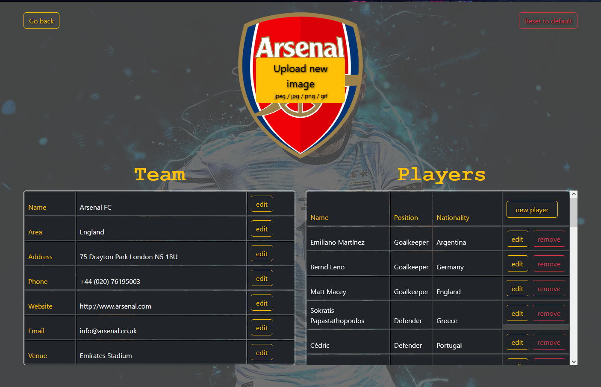
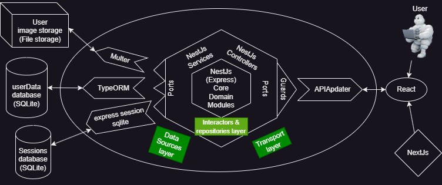

# Football teams CRUD project

## About the Project

This project serves as a playground for exploring full-stack web development concepts. It began
with a basic Express/Handlebars structure and evolved to incorporate React, NestJS, NextJS, and
TypeScript for a comprehensive frontend and backend experience as well as Cypress and Jest
for robust testing. It also includes SQlite and TypeORM for database management and storing data

## Expanded Description of Key Features: 

### Team Management

    Create: Add new teams with customized names, properties, and logos (image upload supported).
    Read: View a list of your user-specific teams with basic information and optional filtering.
    Update: Edit existing team details (name, description, logo) to keep them current.
    Delete: Remove unwanted teams from your list permanently.
    Reset: Set a specific team back to its default state, clearing customised information.
    Reset All: Reset all your teams to their default states, starting fresh.

### Player Management

    Add: Assign players to specific teams, providing their names, positions, and country of origin.
    Edit: Modify player information within a team.
    Remove: Take players out of specific teams.

## Main Technologies

    FrontEnd:
    - NextJs w/React
    - Bootstrap
    - TypeScript
    - TailWindCss

    BackEnd:
    - NestJs w/Express
    - session-file-store
    - TypeScript
    - TypeORM
    - SQLite

    Tests:
    - Cypress
    - Jest

    Other:
    - Eslint
    - Prettier

## Architecture

This project follows a hexagonal architecture pattern. This promotes a clean separation of concerns,
making the core application logic independent from external systems like the UI and database

See the diagram below for a visual representation of the application structure:

## How to use

### Prerequisites:

-Ensure you have [Node.js](https://nodejs.org/en) (or yarn) installed on your machine

### Installation:

-Clone the project repository

-Navigate to the project root directory and  run the following command to install all the necessary

project dependencies `npm run installApp`

### Environment Variables:

-Create a .env file in the backend folder, add the following variables and adjust them to your needs:

`SECRET_KEY="THISISASECRETKEY"` # Replace with a strong secret key

`DB_USERNAME="username"` # Replace with your database username

`DB_PASSWORD="password"` # Replace with your database password, if any

`DB_PATH="./src/userData/userData.db"` # Path to your user database file

`SESSION_DB_PATH='./src/userData/sessions.db'` # Path to your sessions database file

`BASE_USER_FOLDER_PATH="./src/userData/default"` # Path to default user data json files

`CLIENT_BASE_URL="http://localhost:8080"` # Base URL to your frontend application

`PRODUCTION="false"` # Set to `true` for production deployment

there is an environment configuration in the frontend root folder, next.config.js, modify if neccesary

`BASE_API_URL: "http://localhost:3000"`

### Create Database Files:

-There should exist sessions.db and userData.db on their corresponding paths (SESSION_DB_PATH & DB_PATH),
if they do not, create them.

### Run the server in development mode:

Onn windows:

`npm run dev:windows`

2 windows will popup - one for NextJs and the other one for NestJs

On any:

`npm run dev` # this will run both back and front ends with concurrently, on the same console

The front-end server will run by default on port 8080 and the back-end server on port 3000.

-Access from a web browser to `localhost:8080`

-Login with any username

-Do stuff, see [Team and Player Management](#team-management)

### Running front and back end server separately

Front:

`cd frontend`

`npm run dev`

Back:

`cd backend`

`npm run dev`

For test runs see [Tests](#tests)

## Tests 

### Cypress - UX/UI Testing

-Run the servers

-Run cypress `npm run cypress`

-Select end to end testing

-Select browser

-Select file `spec.cy.js`

There's a disabled test for removing all players from a team, but it lacks any assertions

### Jest - Unit and Integration Testing

-Run jest (currently only for backend) `npm run jest`

If on Windows, you can run it on a separate console `npm run jest:windows`

## Known Limitations

### Limited Security

    The app lacks mechanisms to prevent unauthorized access or data manipulation since
    password protection is not implemented, making accounts vulnerable to unauthorized access.

## Credits

[Javascript Course Argentina Programa](https://argentinaprograma.com/)

[Course video for this project](https://www.youtube.com/watch?v=8LxxQeNCu4U&list=PLs73pLtDNXD893LSF8fP-EfZbGWMECmnc&index=17)
